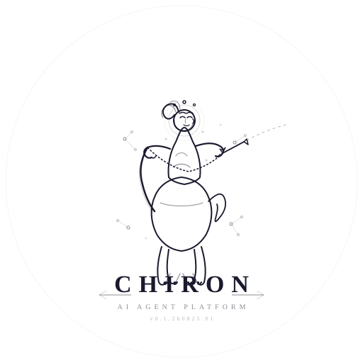

# Chiron

> Chiron 是一个多租户 SaaS AI Agent 平台，采用 **Go 网关 + Python AI 引擎 + Vue 3 前端** 的三层架构。
> 
> 对话、Agent、工作流、技能、知识库与插件一体化，全栈能力自由组合；轨迹可循、过程可见，轻松 Harness。

## 架构概览

```
┌─────────────────────────────────────────────────┐
│                  前端 (Vue 3)                    │
│         frontend-vue/  —  :5173                 │
├─────────────────────────────────────────────────┤
│               Go 网关 (chiron)                   │
│  cmd/chiron  —  :8080                           │
│  认证 · 路由 · 限流 · 计费 · 管理后台                │
├─────────────────────────────────────────────────┤
│            Python AI 引擎 (python-engine)        │
│  python-engine/  —  :8000                       │
│  对话 · Agent · 工作流 · RAG · 技能 · 记忆 · MCP    │
├─────────────────────────────────────────────────┤
│     PostgreSQL (pgvector)  ·  Redis  ·  Milvus  │
│     MinIO/S3  ·  Temporal (可选)                 │
└─────────────────────────────────────────────────┘
```

## 快速开始

```bash
# 1. 克隆
git clone https://github.com/athenavi/chiron.git && cd chiron

# 2. 启动基础设施
docker compose up -d postgres redis

# 3. 配置环境变量
cp .env.example .env
# 编辑 .env，填写 APP_SECRET

# 4. 安装依赖并启动
python run.py setup      # 首次：安装 Python 依赖、前端依赖
python run.py start      # 启动网关(:8080) + 引擎(:8000) + 前端(:5173)
```

## 核心能力

| 能力 | 说明 |
|------|------|
| **对话** | 多模型支持，流式响应，上下文记忆 |
| **Agent** | 多 Agent 协作，工具调用，代码执行 |
| **工作流** | 可视化 DAG 编排，动态节点 |
| **技能 (Skill)** | 可复用的 AI 能力模板 |
| **知识库** | 多格式文档导入，RAG 检索增强 |
| **插件** | MCP 协议支持，第三方工具集成 |
| **记忆** | 多层级记忆系统，用户画像 |
| **多租户** | 租户隔离，RBAC 权限，配额管理 |

## 技术栈

- **网关:** Go 1.26+, Gin, PostgreSQL, Redis
- **引擎:** Python 3.11+, FastAPI, LLM 网关, vector store
- **前端:** Vue 3, TypeScript, Vite 8, Pinia, Vue Router
- **CI/CD:** GitHub Actions, Docker, Docker Compose

## 文档

- [贡献指南](CONTRIBUTING.md)
- [安全策略](SECURITY.md)
- [API 文档](docs/openapi.yaml)
- [架构说明](docs/ARCHITECTURE.md)

## 许可

[MIT](LICENSE)
